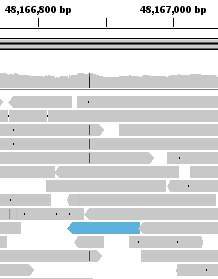
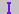
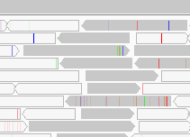
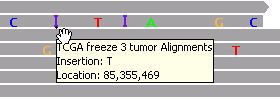
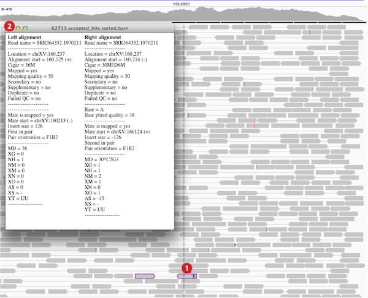
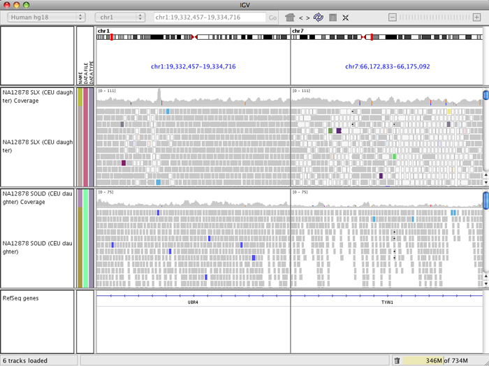

This page introduces viewing alignment data and associated tracks in the following sections:

*   [File Formats](#fileformats)
*   [Read Coverage Track](#coverage)
*   [Downsampling](#downsampling)
*   [Alignment Track](#alignmenttrack)
*   [Paired-end Alignments](#paired)

Related topics on **other pages** cover more detailed topics:

*   [Alignment Preferences panel](<?php echo base_path(); ?>Preferences#Alignments) settings
*   Alignment track [pop-up menu](<?php echo base_path(); ?>PopupMenus#AlignmentTrack) options
*   [Interpreting Color by Insert Size](http://software.broadinstitute.org/software/igv/interpreting_insert_size)
*   [Interpreting Color by Pair Orientation](http://www.broadinstitute.org/software/igv/interpreting_pair_orientations)
*   [Interpreting Color by Bisulfite Mode](http://www.broadinstitute.org/software/igv/interpreting_bisulfite_mode)
*   [Splice Junctions Track](#junctions)
*   [Sashimi Plots](http://www.broadinstitute.org/software/igv/Sashimi)

File Formats
------------

Aligned reads from sequencing can be loaded into IGV in the [BAM](<?php echo base_path(); ?>BAM) format, [SAM](<?php echo base_path(); ?>SAM) format, or [CRAM](http://<?php echo base_path(); ?>CRAM) format.

Both BAM and SAM files are described on the Samtools project page [http://www.htslib.org](http://www.htslib.org) and in the 2014 article titled [_Sequence Alignment/Map Format Specification_](http://samtools.github.io/hts-specs/SAMv1.pdf) by the SAM/BAM Format Specification Working Group.

IGV requires that BAM and CRAM files have an associated index file.

*   The main data file must include the _.bam_ or ._cram_ extension.
*   The index file should have the same filename but with the _.bai_ or ._crai_ extension. For example, the index file for test-xyz.bam would be named test-xyz.bam.bai, or alternatively test-xyz.bai.
*   When loading by URL, the URL to both the data file and the index file should be specified.
*   When loading by file, IGV automatically searches for the index file within the same directory as the data file.

If you receive a .bam file from a sequencing facility, you will usually also get the corresponding index file. If you need to create the index yourself, there are multiple tools available for indexing BAM files, including [igvtools](http://software.broadinstitute.org/software/igv/igvtools), the [samtools](http://www.htslib.org) package, and the [Picard.SortSam](http://www.broadinstitute.org/cancer/software/genepattern/modules/docs/Picard.SortSam/4) module in [GenePattern](http://www.broadinstitute.org/cancer/software/genepattern/).

Tracks
------

Loading an alignment file creates up to 3 associated tracks:

*   Alignment Track to view individual aligned reads
*   Coverage Track to view depth of coverage
*   Splice Junction Track which provides an alternative view of reads spanning splice junctions

By default the Alignment and Coverage tracks are initially displayed. This setting can be altered from the Alignments tab of the Preferences window.  Also, showing or hiding individual tracks can be controlled with track popup menus.

Note: If hiding the Alignment track by default you might also consider the setting to create all tracks in a single panel. This is in the General tab of the Preferences window.

The Coverage and Alignment tracks are described below. The Splice Junction Track is covered on a [separate page](http://www.broadinstitute.org/software/igv/splice_junctions).

Coverage Track
--------------

By default IGV dynamically calculates and displays the default coverage track for an alignment file. When IGV is zoomed to the alignment read visibility threshold (by default, 30 KB), the coverage track displays the depth of the reads displayed at each locus as a gray bar chart. If a nucleotide differs from the reference sequence in greater than 20% of quality weighted reads, IGV colors the bar in proportion to the read count of each base (A, C, G, T).

*   Override the default threshold for an individual coverage track by right-clicking the track and selecting_Set allele frequency threshold_. For example, set the value to .3 to change the threshold to 30%.
*   To change the default for all coverage tracks, set the value _Coverage allele-fraction threshold_in the_Alignments_ tab under _View > Preferences_. The preferences also include the option to disable quality weighting.

View **count details** by hovering the mouse over a coverage bar. Copy the count details to your computer's clipboard from the right-click menu.

### Pre-computed Coverage Data

The dynamically calculated coverage data can be augmented by loading pre-computed coverage data from a file. When this option is used the track displays coverage at all zoom levels including at the whole genome and chromosome view. To generate the extended coverage data file ending in [TDF](http://www.broadinstitute.org/software/igv/TDF) extension, use [igvtools](<?php echo base_path(); ?>igvtools). The resulting file can be associated with the alignment track by file naming convention or loaded independently from the track popup-menu.

*   To associate a coverage track using filename, the track must be named <alignment file name.extension>.tdf, and placed in the same directory as the alignment track.

    *   For example, the coverage track for test.bam would be named test.bam.tdf. IGV loads this coverage track automatically when test.bam is loaded.

*   To dynamically associate coverage data with a BAM track, right-click on the coverage track and choose _Load pre-computed coverage data_ from the pop-up menu.

Visibility Range Threshold and Downsampling
-------------------------------------------

IGV reduces memory usage in the following two ways to improve performance of viewing alignments.

*   A **visibility range threshold** defines the size of the region in view at which alignments are loaded. If the region is view is larger than this threshold, no alignments are visible. Default: 30 kb  

*   In areas of deep read coverage, by default the **reads** **are downsampled**, i.e. not all the reads are displayed. The level of downsampling is controlled with the parameters:
    *   Max read count; default 100
    *   Per window size; default 50 bases

You can adjust the above settings in the [Alignment Preferences panel](https://software.broadinstitute.org/software/igv/Preferences#Alignments). For example, for lower coverage data, you can provide a larger visibility range threshold. Or for deep coverage, you might want to provide a smaller visibility range threshold and adjust the downsampling to show more reads.

Downsampled reads areas are marked with a black rectangle just under the coverage track. The coverage track represents coverage for _all_ the reads.

In the example shown, the downsampled regions are marked by seven black rectangles just under the coverage track.

Alignment Track
---------------

This section gives an overview of the alignment track. For options available from the alignment track menu, including grouping, sorting and coloring options, see the alignments section of the [pop-up menu](<?php echo base_path(); ?>PopupMenus#AlignmentTrack) page.

*   When zoomed in to the alignment read visibility threshold, by default 30 KB, IGV shows the reads. The default visibility range threshold can be changed in the [Alignment Preferences panel](<?php echo base_path(); ?>Preferences#Alignments).

 

*   When zoomed in sufficiently, IGV can display a **line at the center of the display.** At higher resolutions, the center line becomes two lines that frame the bases centered in the display, as shown in the figure above.
    *   The framed bases are the basis for _Sort by_ operations for alignment tracks (see details below).
    *   Enable the display of the center line by setting the _Show center line_ property in the [Alignment Preferences panel](<?php echo base_path(); ?>Preferences#Alignments).

### Detecting Structural Variants

IGV uses color and other visual markers to highlight potential genetic alterations in reads against a reference sequence. Genetic alternations include single nucleotide variations, structural variations, and aneuploidy. Structural variations include insertions, deletions, inversions, tandem duplications, translocations, and other more complex rearrangements. Interpretation of some of these variations are discussed briefy in this section and the next. [Interpreting Color by Insert Size](http://www.broadinstitute.org/software/igv/interpreting_insert_size) and [Interpreting Color by Pair Orientation](http://www.broadinstitute.org/software/igv/interpreting_pair_orientations) give more detailed explaination of read colors.

An additional factor to take into consideration when judging potential genetic alterations is quality of reads and quality of mapping. IGV uses transparency to indicate quality.

*   For RNA-Seq, [TopHat](http://ccb.jhu.edu/software/tophat/index.shtml) outputs separate insertions.bed and deletions.bed files which IGV will load as separate tracks.
*   In addition to the .[BED](http://www.broadinstitute.org/software/igv/BED) format, the .[VCF](http://www.broadinstitute.org/software/igv/VCF) format file displays structural variation.

Colors and transparency are used at two levels within alignments: (1) for mapped reads, and (2) for individual bases within reads.

**Color**

**Transparency**

**mapped reads**

see [Paired-End Alignments](#paired) section

mapping quality

**individual bases**

Mismatched bases

read quality (phred) score

### Color and Transparency for Individual bases

By default, read bases that match the reference are displayed in gray. Read bases that do not match are color coded, and insertions and deletions within reads relative to the reference are marked. Insertions are indicated by a purple _I_ () and deletions are indicated with a black dash (**–**). In addition, mismatched bases are assigned a transparency value proportional to the read quality known as the [phred](http://en.wikipedia.org/wiki/Phred_quality_score) score. This has the effect of de-emphasizing low quality reads.

*   To color code all bases, regardless of whether they are mismatched, right-click the track and select _Show All Bases_ from the [pop-up menu](<?php echo base_path(); ?>PopupMenus#AlignmentTrack).
*   To mark insertions greater than a specified size with a red _I_, select and specify the size cutoff for the _Flag insertions larger than_ parameter in the [Alignment Preferences panel](<?php echo base_path(); ?>Preferences#Alignments). This is a new feature starting with IGV v2.3.46, released March 2015.
*   Transparency shading of quality can be turned off temporarily from the [pop-up menu](<?php echo base_path(); ?>PopupMenus), or persistently from [Alignment Preferences panel](<?php echo base_path(); ?>Preferences#Alignments).
*   To change the default nucleotide coloring scheme for reads, see [Modify the prefs.properties file](http://www.broadinstitute.org/software/igv/prefs.properties).

### Transparency for Mapped Reads

Note that alignments that are displayed with light gray borders and transparent or white fill, as shown in the screenshot, have a mapping quality equal to zero. Interpretation of this mapping quality depends on the mapping aligner as some commonly used aligners use this convention to mark a read with multiple alignments. In such a case, the read also maps to another location with equally good placement. It is also possible the read could not be uniquely placed but the other placements do not necessarily give equally good quality hits.

### Insertions

In a gapped alignment, IGV indicates insertions with respect to the reference with a purple _I_ (; ?>sites/cancerinformatics.org.igv/files/images/icon_insertion.jpg)) or red _I_ for insertions greater than a user activated and specified cutoff. Hover over the insertion symbol to view the inserted bases.

### 

### Deletions

In a gapped read, IGV indicates deletions with respect to the reference with a black bar.

### Coloring and Sorting Alignments

Users can also specifiy color and also sort reads by various options, including start location, strand, nucleotide, mapping quality, sample tag, or read group tag. For a description of all user-specified color and sort options, see the alignment track [pop-up menu](<?php echo base_path(); ?>PopupMenus#AlignmentTrack).

For example, to sort alignments:

1.  Right-click a track for the pop-up menu.
2.  Select a _Sort_ option from the pop-up menu. IGV sorts the alignments that intersect the locus at the center of the track, no matter where the cursor was located for the right-click. To display a line down the center of the track, set the _Show center line_ property in the [Alignment Preferences panel](<?php echo base_path(); ?>Preferences#Alignments).

Sorting rearranges rows so that alignments that intersect the center of the display appear in the order specified. This can cause the alignment layout away from the center line to appear sparse.  To restore the layout to an optimally packed configuration, select _Re-pack alignments_ from the [pop-up menu](<?php echo base_path(); ?>PopupMenus#AlignmentTrack).

Repeat the most recent sort with hotkey _ctrl-s_.

Paired-End Alignments
---------------------

IGV provides several features for working with paired-end alignments. This section covers viewing reads as pairs, coloring of mapped paired reads, and the split-screen view. Interpretation of colors is discussed briefy here and in more detail in [Interpreting Color by Insert Size](http://www.broadinstitute.org/software/igv/interpreting_insert_size) and [Interpreting Color by Pair Orientation](http://www.broadinstitute.org/software/igv/interpreting_pair_orientations).

### View As Pairs

By default, IGV displays reads individually because they pack compactly. Select _View as pairs_ from the right-click menu to display pairs together with a line joining the ends as shown in the image below. The hover element details (2) are also displayed either for a single read in **normal view (left)** or for a pair of reads in **paired reads view (right)**.

 

### Coloring of Mapped Paired Reads

IGV colors paired-end alignments in two ways.

*   Interactively by user selection as shown in the purple highlighted reads marked by (1) in the images above, and
*   That deviate from expectations as marked by (3) in the image above.

Control+click (Mac: Command+click) a read to outline the read and its paired mate in the same color. Colors are arbitrary but unique to each pair. A black outline indicates that the selected read has no mate.

*   Control+click (Command+click) either read to clear the outline.
*   Right-click and select _Go to Mate Region_ to jump to the paired mate.
    *   If the paired reads have a large insert size, the paired mate will not be highlighted. Turn on the Color by insert size and pair orientation option from the popup menu to confirm as described below.
*   Right-click and select _Clear Selections_ to clear all outlines.

Outlined paired reads are preserved when switched to _View as pairs_ option. However, outlining reads only works in the unpaired view and not in the paired view.

Hover over or click a read to view information about the read, including the location of its paired mate.

IGV colors (1) paired end reads with inferred insert size smaller or larger than expected; (2) read with mate that is aligned to a different chromosome; (3) paired-end alignments with deviant pair orientation. Note that coloring by insert size is a feature designed originally for DNA alignments _against the genome_. It is based on set base pair values or computed from the size distribution of a library.

*   See [Interpreting Color by Insert Size](http://www.broadinstitute.org/software/igv/interpreting_insert_size) for more detail.
    *   Blue is for inserts that are smaller than expected
    *   Red is for inserts that are larger than expected.
    *   Inter-chromosomal rearrangements are color-coded by chromosome.
*   See [Interpreting Color by Pair Orientation](http://www.broadinstitute.org/software/igv/interpreting_pair_orientations) for more detail.
    *   Shades of green, teal, and dark blue show structural events of inversions, duplications, and translocations.
    *   Color assignments depend on sequencing platform.
*   Other _Color by_ options are described in the alignment track [pop-up menu](<?php echo base_path(); ?>PopupMenus#AlignmentTrack) options

Translocations on the same chromosome can be detected by color-coding for pair orientation, whereas translocations between two chromosomes can be detected by coloring by insert size. See both by selecting the _Color alignments by>_ _insert size and pair orientation_ option.

### Split Screen View

Split screen views can be invoked on-the-fly from paired-end alignment tracks. Right-click over an alignment and select _View mate region_ _in split screen_ from the drop-down list. If the alignment clicked over does not have a mapped mate this option will be grayed out. You can select this option for mutliple alignments and view multiple panels side by side.

To return to a normal single screen view, right-click on the locus name at the top of the panel you wish to keep and select _Switch to standard view_. Alternatively, double-click the locus name.

You can control the view of each panel independently. Pan by click-dragging in the panel;  double-click to zoom in and alt-click to zoom out.

