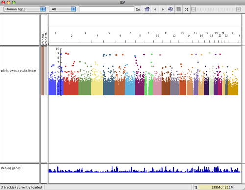
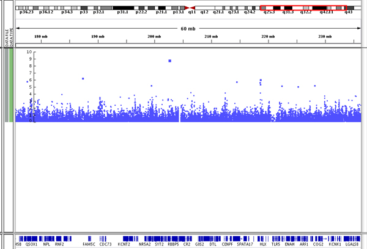
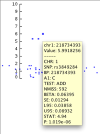
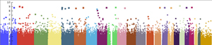
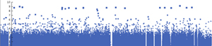
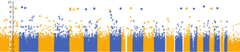

IGV can display genome-wide association study (GWAS)  data as a "manhattan plot", color-coded by chromosome. Data
formats are described [here](<?php echo base_path(); ?>GWAS).

The plot represents the significance of the association between a SNP or haplotype and the trait being measured. The
Y-axis shows -log10 transformed P values, which represent the strength of association.

The size of the data points in the plot and their height on the left-hand side of the data pane relate directly to their
significance: the larger the point and the higher the point on the scale, the more significant the association with the
trait. You can see the point size difference in the following screenshot of data on chromosome 1.

As in other parts of IGV, hovering over a data point allows you to see a pop-up containing the data specifically
associated with that point. You can see the pop-up for the topmost data point in this image. Note that the point's
position on the scale on the left is associated with its _P_ value.

GWAS Pop-up Menu
----------------

The following commands appear in the pop-up menu for GWAS tracks:

Command

Description

Rename Track

Renames the track.

Remove Track

Removes the selected track from the display.

Set Data Range...

Changes the minimum, baseline, and maximum values of the scale used for the GWAS data.

Change Track Height...

Changes the display height of the track.

**Color Scheme**  
Chromosome color  
Single color  
Alternating color

Changes the display to use different color schemes for the chromosome color-coding. The chromosome color scheme (
default) uses the colors defined by IGV.

The single color scheme changes all the chromosomes to display in a single color (blue by default).

The alternating color scheme uses two colors (blue and gold by default) that alternate through the chromosomes.

Set primary color...

Set the color for the single color scheme and for one of the colors in the alternating color scheme.

Set alternating color...

Set the alternating color in the alternating color scheme.

Set minimum point size...

Set the minimum data point display size.

Set maximum point size...

Set the maximum data point display size.

Save image...

Save the current display as an image file. Specify the file format by setting the filename extension in the file save
dialog to .png, .jpeg, .jpg, or .svg.