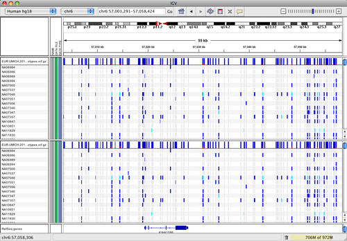
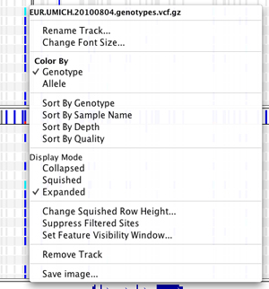

VCF stands for Variant Call Format, and this file format is used by the 1000 Genomes project to encode SNPs and other
structural genetic variants. The format is further described on
the [1000 Genomes project Web site](http://www.1000genomes.org/wiki/Analysis/Variant%20Call%20Format/VCF%20%28Variant%20Call%20Format%29%20version%204.0/encoding-structural-variants)
.

Viewing a VCF File with Genotypes
---------------------------------

 Each bar across the top of the plot shows the allele fraction for a single locus.

 The genotypes for each locus in each sample. Dark blue = heterozygous, Cyan = homozygous
variant, Grey = reference. Filtered entries are transparent.

If a file has more than 10 genotypes, the VCF file will be opened in its own pane, with a scroll bar, as shown below.

### VCF Popup Menu

To see the options for changing the view of your VCF file, right-click on a variant. Some of the options are specific to
the variant selected. Find more details on the menu options on
the [Pop-up Menu](http://www.broadinstitute.org/software/igv/PopupMenus#VCF) page.

The window size at which VCF data is loaded is proportional to the number of samples. To change this, right-click and
select _Set Feature Visibility Window..._

To change the color coding of the plot, select _Color By>Allele_.

The _Sort Variant By_ options allow you to sort the set by a trait of a specific variant. You can select the sort twice
for the same variant to flip it, i.e., if you sort depth, it sorts from high to low; select the depth sort a second time
to sort from low to high.

The Display Mode changes what you can see of the data:

Collapsed removes all the genotypes, leaving only the allele frequency bars.

Expanded shows the genotypes at the usual row height, with the sample names in the first column.

Squished shows the genotypes with the rows compressed to maximize the data visible on the page.

You can also adjust the height of the squished row by right-clicking and selecting _Change Squished Row Height_. You can
change the height of the rows in the window provided.

Viewing a VCF File Without Genotypes
------------------------------------

If you open a VCF file that does not contain genotypes data, the view will be different, displaying only the bars
marking the calls, as shown below.

Similarly, the popup menu will be more limited, with only the _Set Feature Visibility Window..._ and _Remove Track_
options functional.